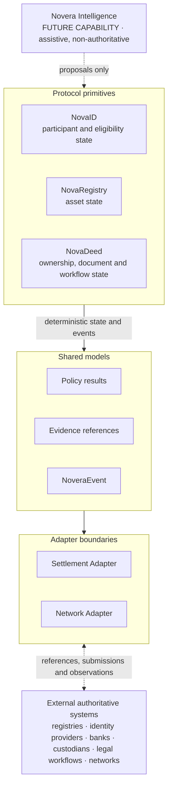

# Novera Protocol Specification v0.1

**Status: PRE-PRODUCTION / DESIGN SPECIFICATION**

Novera Protocol is infrastructure for real-world assets. This repository is the technical source of truth for Novera's architecture, protocol primitives, state models, schemas, trust boundaries and first reference workflow.

This is a specification repository. It contains no smart contracts, no token, no deployed service and no application code beyond a schema validator.

> **Read this first**
>
> - No production Novera network is live.
> - No production blockchain has been selected.
> - Schemas are at version 0.1 and may change in incompatible ways before a stable release.
> - This repository defines architecture and interfaces. It does not define, create or record legally authoritative asset ownership.
> - Implementations MUST preserve the boundaries with external authoritative systems described in [architecture/trust-boundaries.md](architecture/trust-boundaries.md).
> - All example data is synthetic and labelled `SYNTHETIC EXAMPLE DATA`.

## What Novera is

Real-world asset workflows depend on several systems that do not share state: identity and eligibility providers, asset registries, document and legal workflows, policy evaluation, evidence, and settlement. Novera is designed as a modular coordination layer between them. It coordinates:

- identity and eligibility state associated with a workflow,
- asset state,
- ownership and workflow state,
- policy conditions and their evaluation results,
- evidence references, and
- settlement interfaces.

Novera coordinates state and workflow. It does not replace authoritative external systems. Government and land registries, identity providers, banks, custodians, transfer agents, broker-dealers, legal professionals, payment rails, title systems, regulators and authoritative data providers keep their roles. Novera maintains structured workflow state and references evidence and authoritative external sources where required.

## Maturity vocabulary

This repository uses four terms precisely. They are not interchangeable.

| Term | Meaning in this repository |
| --- | --- |
| **Implemented** | Exists in this repository and runs. In v0.1 this is limited to the JSON Schemas, the synthetic examples, the validator, its tests and CI. |
| **Specified** | Described normatively in this repository. No production implementation exists. |
| **Planned** | Intended specification work that has not been written yet. |
| **Future** | A capability that may be designed or built later, subject to separate decisions. It is not part of v0.1. |

| Area | v0.1 maturity |
| --- | --- |
| Data models for NovaID, NovaRegistry and NovaDeed | Specified, with schemas implemented |
| NoveraEvent model and event authority rules | Specified, with schema and validator implemented |
| Evidence and policy-result models | Specified, with schemas implemented |
| NovaDeed reference state machine | Specified; checked by the validator for the examples |
| Settlement Adapter and Network Adapter boundaries | Specified as interface semantics only; no adapter exists |
| Novera Intelligence | Future capability; only its boundary is specified |
| Protocol reference implementation, APIs, SDKs, contracts | Not started; not part of this repository |

## Core architecture

The diagram is conceptual. Arrows show the direction in which information is offered, not automatic writes. No layer writes to another without passing the validation and confirmation rules in [architecture/event-model.md](architecture/event-model.md).



The core concepts are documented in [architecture/](architecture/):

| Document | Subject |
| --- | --- |
| [overview.md](architecture/overview.md) | Layers, records, identifiers, conformance language |
| [state-model.md](architecture/state-model.md) | Record versions, state references and state digests |
| [event-model.md](architecture/event-model.md) | NoveraEvent types, authority rules, ordering and idempotency |
| [event-authentication.md](architecture/event-authentication.md) | Signed envelopes, actor/key binding, delegation and domain separation |
| [event-integrity.md](architecture/event-integrity.md) | Per-subject audit-history digest chains and anchoring boundary |
| [evidence-model.md](architecture/evidence-model.md) | Evidence as independent, hash-referenced records |
| [policy-model.md](architecture/policy-model.md) | Policy evaluation results, not legal determinations |
| [trust-boundaries.md](architecture/trust-boundaries.md) | What Novera records, references and never decides |
| [settlement-adapter.md](architecture/settlement-adapter.md) | `prepare`, `validate`, `submit`, `observe`, `reconcile` semantics |
| [network-adapters.md](architecture/network-adapters.md) | Chain-agnostic persistence, anchoring and observation |
| [intelligence-boundary.md](architecture/intelligence-boundary.md) | Why AI output is always a proposal |

## Three primitives

| Primitive | Represents | Does not represent |
| --- | --- | --- |
| [NovaID](primitives/novaid.md) | Participant and eligibility state associated with a Novera workflow: scoped claims with issuer, provenance, status and evidence | That Novera is an identity provider, or that any participant is "verified" in a global sense |
| [NovaRegistry](primitives/novaregistry.md) | Structured asset state: identifiers, attributes, relationships and references to authoritative records | An authoritative registry, title or ownership record |
| [NovaDeed](primitives/novadeed.md) | Ownership, document and workflow state with explicit, event-backed transitions | Legally effective ownership or title transfer |

## Event model

Every material state transition is represented by a NoveraEvent. A proposal is not a confirmed transition. The event model separates `proposal`, `validation`, `confirmation`, `rejection`, `state_transition` and `external_observation`, and the schema restricts which kind of actor may produce each type. Only a `state_transition` event, recorded by a deterministic system component after the required confirmation, changes a record's current state. Events are protocol-level records; they do not imply blockchain finality. See [architecture/event-model.md](architecture/event-model.md).

## Trust boundary

Novera records are coordination records. Asset, participant and workflow records carry `recordAuthority: "non_authoritative_coordination_record"`, and policy results carry `resultAuthority: "evaluation_result_not_legal_determination"`. When an external system is the authority for a fact, the Novera record points to it with an `authoritative_source` reference instead of restating it as Novera truth. See [architecture/trust-boundaries.md](architecture/trust-boundaries.md).

## Network posture

Novera is EVM-first and chain-agnostic. The core state models do not depend on any blockchain, and no production network has been selected.

- Base is a leading candidate under evaluation. It is not a selected network.
- Hedera is an optional future adapter.
- Chainlink CRE, CCIP and Proof of Reserve are conditional future integrations.

None of these is a dependency of this specification. Network-specific identifiers appear only inside adapter-produced `networkRefs` and are never canonical Novera identifiers. See [architecture/network-adapters.md](architecture/network-adapters.md) and [ADR 0001](adr/0001-chain-agnostic-core.md).

## Novera Intelligence boundary

Novera Intelligence is a **FUTURE CAPABILITY**. It is an assistive layer, not a fourth state primitive, and it is not authoritative.

> AI proposes. Novera confirms. Authority remains with authorized participants and authoritative providers.

The event schema enforces that an `assistive_system` actor can only emit `proposal` events, must report confidence, and must disclose extraction provenance. Assistive systems cannot evaluate policy, review evidence, determine eligibility or confirm state. See [architecture/intelligence-boundary.md](architecture/intelligence-boundary.md) and [ADR 0003](adr/0003-ai-non-authoritative.md).

## Real estate reference workflow

[workflows/real-estate-reference.md](workflows/real-estate-reference.md) is a **REFERENCE WORKFLOW**. It uses a fictional property purchase to show how the primitives, policy results, evidence and events fit together, including a complete proposal → validation → confirmation → state transition sequence. Real estate is the first worked example, not the scope of the protocol. NovaDeed does not replace a land registry, and Novera does not perform title transfer, provide legal advice or perform regulated settlement in v0.1.

## Repository structure

```text
novera-specs/
├── README.md                     This file
├── LICENSE                       Apache License 2.0
├── CONTRIBUTING.md               How to propose changes
├── SECURITY.md                   Security reporting status
├── package.json                  Validator dependencies and scripts
├── architecture/                 Cross-cutting models and boundaries
├── primitives/                   NovaID, NovaRegistry, NovaDeed
├── schemas/                      JSON Schema Draft 2020-12 definitions
│   └── common.schema.json        Shared definitions referenced by every record schema
├── examples/                     Synthetic examples, one per record schema
│   └── real-estate-sequence/     Synthetic event sequence for the reference workflow
├── workflows/                    Reference workflows
├── adr/                          Architecture decision records, including auth and audit-integrity decisions
├── security/                     Initial threat model
├── scripts/validate-schemas.mjs  Schema and example validator
├── tests/                        Validator tests (node:test)
└── .github/workflows/            CI
```

`schemas/common.schema.json` and `examples/real-estate-sequence/` go beyond the minimum layout. Shared definitions avoid six divergent copies of identifiers, digests and references. The event sequence shows that the event authority rules work across a complete transition, not only for a single event.

### Schema identifiers

Every schema has a stable `$id` of the form `https://schemas.noveraprotocol.org/v0.1/<name>.schema.json`. These URLs are canonical identifiers only. **No schema service is currently hosted at that address**, and the hostname does not resolve at the time of writing. Validators MUST load schemas from this repository and MUST NOT fetch them over the network.

## Validating schemas

Requirements: Node.js 22 or later. CI uses Node.js 24, the current Active LTS release.

```bash
npm ci
npm run validate   # parse, resolve, lint and compile schemas; validate every example
npm test           # validator tests, including negative cases
```

`npm run validate` fails if any of the following is true:

1. a schema does not parse, does not declare Draft 2020-12, or does not compile under Ajv strict keyword checking;
2. a schema `$id` is missing, duplicated, outside the v0.1 namespace, or does not match its file name;
3. a `$ref` points to a missing file, a missing JSON Pointer target or a remote host;
4. an object schema leaves `additionalProperties` undeclared, or a property has no description;
5. an example is missing for a record schema, is not labelled synthetic, or fails validation;
6. a semantic rule fails, such as an illegal NovaDeed transition, a broken transition chain, a state digest that does not match the referenced record, an eligibility state based on an unconfirmed claim, or an event that precedes the events or policy results it relies on.

The test suite mutates copies of the schemas and examples to confirm that each class of error is detected.

## Contributing

See [CONTRIBUTING.md](CONTRIBUTING.md). Significant design changes require an issue first and an ADR. Schema changes require updated examples and tests. Changes must not introduce a production network dependency without an ADR, and must not weaken authoritative-system boundaries.

## Security

See [SECURITY.md](SECURITY.md) and the [initial threat model](security/threat-model.md). This repository has not been security audited. Do not report suspected vulnerabilities through public issues.

## License

Licensed under the [Apache License, Version 2.0](LICENSE).
