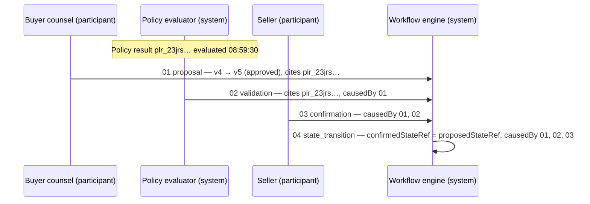

# Event model

**Specification v0.1 — PRE-PRODUCTION / DESIGN SPECIFICATION**

Schema: [event.schema.json](../schemas/event.schema.json) · Example: [event.example.json](../examples/event.example.json) · Sequence: [examples/real-estate-sequence/](../examples/real-estate-sequence/)

## Purpose

A **NoveraEvent** is an immutable protocol-level record of something that happened to a Novera record: a change was requested, evaluated, approved, declined, applied or observed from outside.

Every material state transition across the protocol MUST be represented by a NoveraEvent. A change to a participant, asset, workflow or evidence record that is not backed by a `state_transition` event is not a Novera state change.

## The central rule

> **A proposal is not a confirmed state transition.**

Current state changes only when a `state_transition` event is recorded. Every other event type leaves current state untouched. This holds for every actor, including authorized participants and future assistive systems.

## Event types

| `eventType` | Meaning | Changes current state |
| --- | --- | --- |
| `proposal` | An actor requests that a subject move to a stated new version (`proposedStateRef`) from its current version (`previousStateRef`). | No |
| `validation` | Policy has been evaluated for a proposal. Cites one or more policy results. A validation reports results; it does not approve. | No |
| `confirmation` | An authorized actor approves a specific proposed state. | No |
| `rejection` | A proposal is declined, with machine-readable reasons. | No |
| `state_transition` | A deterministic Novera system component applies a confirmed proposal. Carries `confirmedStateRef`. | **Yes** |
| `external_observation` | An adapter or external provider reports a fact from outside Novera, such as a registry update or a network confirmation. | No |

`eventType` is a closed vocabulary because authority depends on it. Adding a type requires a specification revision and an ADR.

## Authority matrix

The schema restricts which actor types can produce each event type.

| `eventType` | `participant` | `system` | `assistive_system` | `external_provider` | `adapter` |
| --- | --- | --- | --- | --- | --- |
| `proposal` | yes | yes | **yes, only this** | yes | no |
| `validation` | yes | yes | no | yes | no |
| `confirmation` | yes | yes | no | yes | no |
| `rejection` | yes | yes | no | yes | no |
| `state_transition` | no | **only this** | no | no | no |
| `external_observation` | no | no | no | yes | yes |

Further schema-enforced requirements:

- **proposal** — MUST carry `previousStateRef` (null for creation) and `proposedStateRef`.
- **validation** — MUST carry `proposedStateRef`, at least one `causedBy` event and at least one `policyResultRefs` entry.
- **confirmation** — MUST carry `proposedStateRef` and at least one `causedBy` event (the proposal being confirmed).
- **rejection** — MUST carry at least one `causedBy` event and at least one `reasonCodes` entry.
- **state_transition** — MUST carry `previousStateRef`, `confirmedStateRef` and at least one `causedBy` event. Only `state_transition` events may carry `confirmedStateRef`.
- **external_observation** — MUST carry `provenance.sourceRef` and MUST NOT carry `proposedStateRef` or `confirmedStateRef`. An observation can lead to a later proposal; it never applies state itself.
- **assistive_system actors** — MAY only emit `proposal` events, MUST report `confidence`, MUST use `provenance.channel: "assistive_extraction"` and MUST disclose `provenance.extraction`. See [intelligence-boundary.md](intelligence-boundary.md).

The schema cannot decide whether a particular participant is allowed to confirm a particular proposal. That is a workflow authorization decision.

## Authorization of confirmations

An implementation MUST NOT record a `state_transition` unless:

1. the proposal it applies is identified in `causedBy`;
2. `previousStateRef` is the subject's current version at the moment the transition is applied;
3. every policy required for the target state (NovaDeed `policyRefs[].requiredFor`) has a current, applicable result that permits the transition, cited by a validation in `causedBy`;
4. every confirmation required by the workflow's authorization rules has been recorded by an actor holding the required role, and is cited in `causedBy`;
5. `confirmedStateRef` is identical to the proposal's `proposedStateRef`.

Who must confirm which transition is defined by the workflow profile and the deployment's authorization rules, not by this schema. A participant MUST NOT be able to confirm its own proposal when the workflow requires a counterparty or independent confirmation. Implementations MUST authenticate the actor behind every event; an `actorRef` is a claim about who acted, not proof.

## Event fields

| Field | Required | Description |
| --- | --- | --- |
| `eventId` | yes | Opaque event identifier (`evt_…`). |
| `eventType` | yes | One of the six types above. |
| `subjectType`, `subjectId` | yes | The record the event concerns. The identifier prefix MUST match the subject type. |
| `workflowId` | no | The NovaDeed workflow the event belongs to, when the subject is not itself the workflow. |
| `actorRef` | yes | `actorType`, `actorId`, and optionally `role` and `onBehalfOf`. |
| `previousStateRef` | by type | Version the event is based on; null when the subject is being created. |
| `proposedStateRef` | by type | State requested, or the proposed state a validation, confirmation or rejection concerns. |
| `confirmedStateRef` | `state_transition` only | State that became current. |
| `causedBy` | by type | Earlier events this event responds to. |
| `evidenceRefs` | yes (may be empty) | Evidence the actor relied on. |
| `policyResultRefs` | yes (may be empty) | Policy results the actor relied on. |
| `reasonCodes` | rejections | Machine-readable reasons. |
| `confidence` | assistive actors | Producer-reported confidence, informational only. |
| `provenance` | yes | `channel`, and optionally `sourceRef`, `networkRefs` and `extraction`. |
| `idempotencyKey` | no | Producer-supplied retry key. |
| `timestamp` | yes | When the implementation recorded the event. |
| `metadata` | no | Namespaced, non-normative metadata. |

`previousStateRef`, `proposedStateRef` and `confirmedStateRef` MUST refer to the event's own subject. The validator checks this, and the version arithmetic described in [state-model.md](state-model.md).

## Worked sequence

The reference workflow's move from `conditions_pending` to `approved` (workflow version 4 → 5) is represented by four events, all included as synthetic examples:

| File | Event | Actor | Time (UTC) |
| --- | --- | --- | --- |
| [01-proposal.event.json](../examples/real-estate-sequence/01-proposal.event.json) | proposal | buyer counsel on behalf of the buyer | 2026-03-12 09:00:00 |
| [02-validation.event.json](../examples/real-estate-sequence/02-validation.event.json) | validation | policy evaluation system | 09:00:05 |
| [03-confirmation.event.json](../examples/real-estate-sequence/03-confirmation.event.json) | confirmation | seller | 10:00:00 |
| [event.example.json](../examples/event.example.json) | state_transition | workflow engine | 10:00:02 |

The validator checks that every state reference digest in these events matches the synthetic workflow records, that each event is later than the events it cites, and that each cited policy result was evaluated before the event that relies on it.

## Causality and ordering

- `causedBy` MUST list the events an event responds to or depends on. An event MUST NOT cite itself.
- An event's `timestamp` MUST NOT be earlier than the timestamp of any event in its `causedBy`.
- A policy result cited by an event MUST have been evaluated at or before the event's `timestamp`.
- Events for the same subject are ordered by the subject version they produce, not by wall-clock time. Timestamps from different producers can disagree; implementations MUST NOT order state transitions by timestamp alone.

## Idempotency and duplicates

- Event identifiers MUST be unique within a deployment. An implementation MUST reject an event whose `eventId` it has already recorded with different content.
- A producer MAY supply `idempotencyKey`. An implementation SHOULD treat a repeated key from the same actor as a retry of the same request and MUST NOT apply it twice.
- Because every transition names its `previousStateRef`, replaying an old `state_transition` against a newer record fails the concurrency check in [state-model.md](state-model.md).

## Persistence and finality

Events are protocol-level records. This specification does not require a particular store. An implementation MAY persist events in a database, an append-only log or, through a Network Adapter, as anchored digests on one or more networks.

A NoveraEvent does **not** imply blockchain finality, settlement finality or legal effect. When an event is anchored to a network, the adapter's observation of that anchor is a separate `external_observation` event with its own `finality` value in `networkRefs`. See [network-adapters.md](network-adapters.md).

## Integrity

At v0.1, events are not signed by this specification. Implementations MUST authenticate actors and SHOULD protect event logs against modification, for example by hash-chaining events per subject or signing them. A signature envelope is an open question for a later revision. See [security/threat-model.md](../security/threat-model.md).
