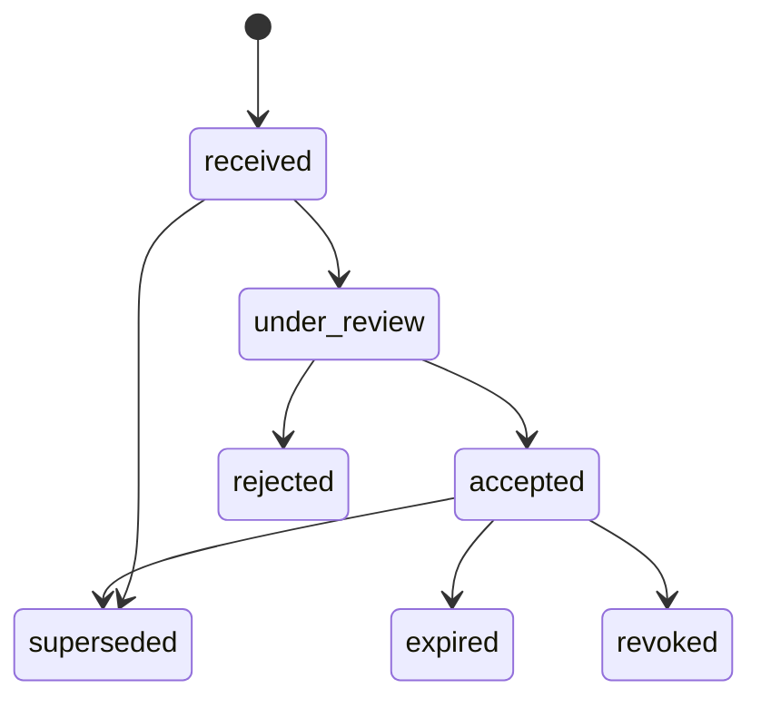

# Evidence model

**Specification v0.1 — PRE-PRODUCTION / DESIGN SPECIFICATION**

Schema: [evidence.schema.json](../schemas/evidence.schema.json) · Example: [evidence.example.json](../examples/evidence.example.json)

## Purpose

An **evidence record** describes a piece of information that supports a claim, a policy result, an asset record or a workflow step: a financing commitment, a title search result, an inspection report, a registry extract, a settlement receipt.

Evidence is referenceable **independently of the state it supports**. One evidence record can support a participant claim, a policy condition and a workflow transition at the same time, and it keeps its own identity, version and status when those records change.

## What an evidence record is not

> The existence of an evidence record does not imply that the underlying document is authentic, legally sufficient, current or valid for any purpose.

An evidence record says that an implementation received or observed something, from a stated source, with a stated content hash, at a stated time. Whether it is authentic or sufficient is a separate question, answered by:

- a **review** recorded on the evidence record for a stated purpose;
- a **policy result** that cites the evidence;
- **confirmation by an authoritative source**, such as a registry or the issuer itself, where the workflow requires it.

Accepting evidence for one purpose does not accept it for any other purpose.

## Fields

| Field | Required | Description |
| --- | --- | --- |
| `evidenceId` | yes | Opaque identifier (`evd_…`). |
| `version` | yes | Record version; see [state-model.md](state-model.md). |
| `evidenceType` | yes | Extensible vocabulary: `identity_verification_report`, `financing_commitment`, `proof_of_funds`, `title_search_result`, `registry_extract`, `inspection_report`, `appraisal_report`, `signed_agreement`, `corporate_resolution`, `custody_statement`, `insurance_certificate`, `settlement_receipt`, `network_observation`, or an extension token. |
| `title` | no | Short human-readable label. MUST NOT contain personal data. |
| `subjectRefs` | yes | The participants, assets, workflows or other records the evidence concerns. |
| `source` | yes | Human-readable name of where the evidence came from. |
| `sourceType` | yes | `issuer_direct`, `authoritative_registry`, `participant_upload`, `professional`, `adapter_observation` or `system_generated`. |
| `contentHash` | yes | Digest of the exact content bytes. |
| `mediaType` | no | IANA media type of the content. |
| `storage` | yes | `hash_only`, `external_reference` or `deployment_store`; see below. |
| `uri` | by storage | Location of the content. Forbidden for `hash_only`. |
| `issuerRef` | yes | Who issued or produced the content. |
| `observedAt` | yes | When the implementation received or observed the content. |
| `issuedAt`, `validFrom`, `validUntil` | no | Validity window stated by the issuer, where applicable. |
| `status` | yes | `received`, `under_review`, `accepted`, `rejected`, `superseded`, `expired` or `revoked`. |
| `review` | for accepted / rejected | `reviewedBy`, `reviewedAt`, `outcome`, `purpose` and optional `reasonCodes`. |
| `supersededBy` | for superseded | The evidence record that replaces this one. |
| `handling` | yes | `classification`, `containsPersonalData` and optional `retentionPolicy`. |
| `createdAt`, `updatedAt` | yes | Record timestamps. |
| `metadata` | no | Namespaced, non-normative metadata. |

## Storage modes

Novera is designed to store a **hash and a reference** rather than the underlying document.

| `storage` | Meaning | `uri` |
| --- | --- | --- |
| `hash_only` | Only the content hash is recorded. The document is held by the participant, issuer or a professional and is produced on request. | MUST NOT be present |
| `external_reference` | The document is held by an external system and can be retrieved from the given location, subject to that system's access control. | MUST be present |
| `deployment_store` | The document is held in a store operated by the deployment. | MUST be present |

Rules:

- Implementations SHOULD prefer `hash_only` for documents that contain personal data or are commercially sensitive.
- A `uri` MUST NOT embed credentials, access tokens or signed query strings. Access control is the responsibility of the system holding the content.
- Anyone presenting the document later can be checked against `contentHash`. A matching hash shows that the bytes are unchanged since the record was created; it does not show that the document is genuine.

## Handling classification

`handling` classifies the **content**, not the evidence record.

- `classification` is `public`, `internal`, `confidential` or `restricted`.
- `containsPersonalData` MUST be true when the content contains personal data. Content with personal data MUST NOT be classified `public`; the validator enforces this.
- The evidence record itself MUST NOT contain personal data beyond what its fields require. In particular `title`, `source` and `metadata` MUST NOT reproduce document contents.

## Review

A review records the outcome of examining the evidence **for a stated purpose**.

- `status: "accepted"` and `status: "rejected"` require a `review`.
- `review.purpose` names the purpose, for example `real_estate.purchase.financing_condition`.
- `review.reviewedBy` MUST NOT be an assistive system. An assistive system can propose that evidence be reviewed or flag an inconsistency; it cannot accept or reject evidence. See [intelligence-boundary.md](intelligence-boundary.md).
- A review by a participant is that participant's determination for that purpose. It is not a statement by Novera.

## Lifecycle

The diagram is illustrative; implementations MAY allow other moves. `superseded` requires `supersededBy`, and a record MUST NOT supersede itself. `expired` requires `validUntil`. Evidence status changes are state transitions and MUST be backed by NoveraEvents.

## Example

[evidence.example.json](../examples/evidence.example.json) is a synthetic financing commitment issued by a fictional lender. It is stored `hash_only`, classified `confidential`, marked as containing personal data, and was accepted by the buyer's counsel for the purpose `real_estate.purchase.financing_condition`. The reference workflow's conditions policy result cites it.

## Open questions

- Whether evidence should support detached signatures from the issuer, and in which format.
- Whether `contentHash` should allow multiple digests to support algorithm migration.
- How retention policies interact with an event history that references evidence that has since been deleted.
