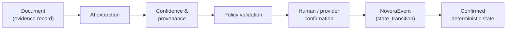

# Novera Intelligence boundary

**Specification v0.1 — PRE-PRODUCTION / DESIGN SPECIFICATION**

**Novera Intelligence status: FUTURE CAPABILITY. It is not built, and this repository does not build it.** This document specifies the boundary any future assistive capability must respect, so that the boundary exists before the capability does.

Related decision: [ADR 0003 — AI non-authoritative](../adr/0003-ai-non-authoritative.md)

## What Novera Intelligence is

Novera Intelligence is a planned **assistive layer**. It would read documents and records and propose structured updates.

It is **not**:

- a fourth state primitive — it holds no state of its own;
- authoritative — nothing it produces is Novera state until confirmed;
- an evaluator, reviewer or decision-maker of record.

## The rule

> **AI proposes. Novera confirms. Authority remains with authorized participants and authoritative providers.**

"Novera confirms" means that the deterministic Novera core applies a state transition only after policy validation and confirmation by an authorized participant or provider, as defined in [event-model.md](event-model.md). It does not mean that Novera itself makes a judgement about the proposal's content.

## Pipeline

| Stage | Who acts | Output | Changes Novera state |
| --- | --- | --- | --- |
| 1. Document | Participant, issuer or provider supplies content | Evidence record with `contentHash` | No (the evidence record itself follows normal rules) |
| 2. AI extraction | Assistive system | Candidate structured values | No |
| 3. Confidence & provenance | Assistive system | `proposal` event with `confidence`, `provenance.extraction` and per-field provenance | No |
| 4. Policy validation | Deterministic system, external provider or authorized reviewer | Policy result and `validation` event | No |
| 5. Human / provider confirmation | Authorized participant or authoritative provider | `confirmation` event, or `rejection` | No |
| 6. NoveraEvent | Deterministic Novera system component | `state_transition` event with `confirmedStateRef` | **Yes** |
| 7. Confirmed deterministic state | — | New record version | — |

Only stage 6 changes state, and only a deterministic system component may perform it.

## Enforced in the schemas

These limits are not left to implementation discipline. They are part of [event.schema.json](../schemas/event.schema.json), [policy-result.schema.json](../schemas/policy-result.schema.json), [evidence.schema.json](../schemas/evidence.schema.json) and [participant.schema.json](../schemas/participant.schema.json), and the test suite checks that violations are rejected.

| Rule | Where |
| --- | --- |
| An `assistive_system` actor MAY emit only `proposal` events. | event schema |
| An assistive proposal MUST carry `confidence`. | event schema |
| An assistive proposal MUST use `provenance.channel: "assistive_extraction"`. | event schema |
| An assistive proposal MUST disclose `provenance.extraction`: `method`, `modelIdentifier` and at least one `inputEvidenceRefs` entry. | event schema |
| Per-field provenance (`fieldProvenance`) links each proposed value, by JSON Pointer, to the evidence and location it came from, with its own confidence. | event schema |
| An assistive system MUST NOT be the evaluator of a policy result. | policy-result schema |
| An assistive system MUST NOT review (accept or reject) evidence. | evidence schema |
| An assistive system MUST NOT determine an eligibility state. | participant schema |
| An assistive system's actor identifier MUST be a system identifier (`sys_…`), distinct from participants. | common schema |

`confidence` is informational. A high confidence value MUST NOT lower the validation or confirmation requirements for a transition. Implementations MAY use confidence to route proposals for review, but never to skip review.

## Intended initial scope

When built, the initial scope of Novera Intelligence is intended to be limited to:

| Capability | Would propose | Would not do |
| --- | --- | --- |
| **Asset Intelligence** | Structured NovaRegistry attributes and identifiers extracted from asset documents; classification of documents; flags where documents disagree with the asset record | Register assets, confirm attributes, change authoritative references |
| **Evidence Intelligence** | Classification of evidence type; summaries for reviewers; inconsistencies between evidence items or between evidence and records; candidate validity dates | Accept, reject or review evidence; decide sufficiency or authenticity |

Methods the extraction definition allows: `document_extraction`, `classification`, `summarization`, `inconsistency_detection`, or a namespaced extension. Proposing structured updates is done through the `proposal` event itself.

## Explicitly out of scope

The following are out of scope for Novera Intelligence, now and in its intended initial scope:

- autonomous compliance;
- underwriting;
- eligibility decisions;
- AI-controlled settlement;
- AI output becoming authoritative state;
- automated legal determinations.

Any change to this list requires an ADR superseding ADR 0003.

## Risks

Assistive extraction introduces specific threats, covered in [security/threat-model.md](../security/threat-model.md): malicious extraction, prompt injection through documents and incorrect interpretation. The boundary above limits their effect to bad proposals, which validation and confirmation must catch. It does not eliminate them: a reviewer who confirms an incorrect proposal without checking it confirms an incorrect state. Implementations SHOULD show reviewers the source location of every proposed value and SHOULD NOT pre-fill confirmations.

## Not in v0.1

- Any model, prompt, pipeline or service.
- Any benchmark or accuracy claim.
- Any assistive example data beyond the schema rules; the synthetic examples contain no assistive events.
