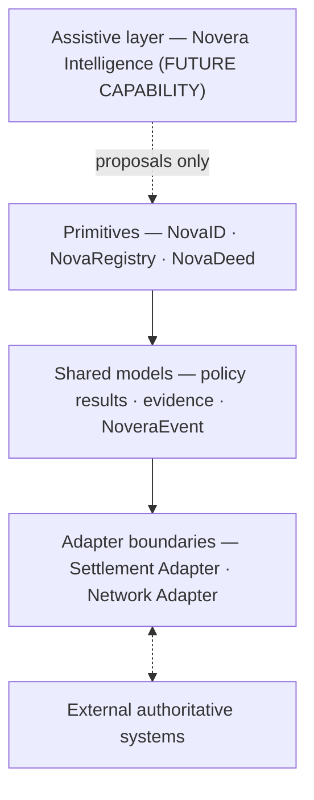

# Architecture overview

**Specification v0.1 — PRE-PRODUCTION / DESIGN SPECIFICATION**

This document introduces the layers, records and conventions shared by the rest of the specification. The detailed rules are in the linked documents.

## Conformance language

The key words MUST, MUST NOT, REQUIRED, SHALL, SHALL NOT, SHOULD, SHOULD NOT, RECOMMENDED, NOT RECOMMENDED, MAY and OPTIONAL in this specification are to be interpreted as described in BCP 14 ([RFC 2119](https://www.rfc-editor.org/rfc/rfc2119), [RFC 8174](https://www.rfc-editor.org/rfc/rfc8174)) when, and only when, they appear in all capitals.

An **implementation** is software that creates, stores, validates or acts on Novera records. No conforming implementation exists at v0.1.

## Problem

A real-world asset workflow, such as a property purchase, a fund subscription or a secured loan, spans systems that do not share state:

- identity and eligibility providers decide who a participant is and whether they qualify;
- registries, transfer agents and custodians record what an asset is and who holds it;
- legal and document workflows produce agreements, conditions and approvals;
- policy rules decide whether a step may proceed;
- evidence is scattered across those systems;
- settlement providers move funds and register outcomes.

Each system is authoritative for its own facts. None of them holds the combined state of the workflow. Novera is designed to hold that combined state as structured, versioned and event-backed records, and to reference the authoritative systems instead of replacing them.

## Layers



The arrows describe dependency and information flow. They do not imply that a layer writes directly into another; every state change passes the event rules in [event-model.md](event-model.md).

| Layer | Responsibility | Maturity at v0.1 |
| --- | --- | --- |
| Assistive layer | Reads documents and proposes structured updates. Never authoritative. See [intelligence-boundary.md](intelligence-boundary.md). | Future capability; boundary specified |
| Primitives | Hold participant, asset and workflow state. See [primitives/](../primitives/). | Specified; schemas implemented |
| Shared models | Policy evaluation results, evidence references and events used by every primitive. | Specified; schemas implemented |
| Adapter boundaries | Isolate settlement providers and networks from the core. See [settlement-adapter.md](settlement-adapter.md) and [network-adapters.md](network-adapters.md). | Interface semantics specified; no adapter exists |
| External systems | Registries, identity providers, banks, custodians, legal professionals, payment rails, networks. | Outside Novera |

## Records

Every Novera record is a JSON document with a `recordType` discriminator, a `specVersion` and a `metadata` object.

| Record | Schema | Owner | Versioned |
| --- | --- | --- | --- |
| Participant | [participant.schema.json](../schemas/participant.schema.json) | NovaID | Yes |
| Asset | [asset.schema.json](../schemas/asset.schema.json) | NovaRegistry | Yes |
| Workflow | [workflow.schema.json](../schemas/workflow.schema.json) | NovaDeed | Yes, with an embedded transition history |
| Evidence | [evidence.schema.json](../schemas/evidence.schema.json) | Shared | Yes |
| Policy result | [policy-result.schema.json](../schemas/policy-result.schema.json) | Shared | Immutable; replaced through `supersedes` |
| Event | [event.schema.json](../schemas/event.schema.json) | Shared | Immutable |

Shared definitions (identifiers, digests, actor references, state references, scopes, external and network references) are in [common.schema.json](../schemas/common.schema.json).

Participant, asset and workflow records carry `recordAuthority: "non_authoritative_coordination_record"`. Policy results carry `resultAuthority: "evaluation_result_not_legal_determination"`. These constants are part of the schema so that no consumer can mistake a Novera record for an authoritative one. See [trust-boundaries.md](trust-boundaries.md).

## Identifiers

Novera identifiers are opaque protocol identifiers:

```text
<prefix>_<26 lowercase Crockford base32 characters>
```

| Prefix | Identifies |
| --- | --- |
| `ptc` | participant |
| `ast` | asset |
| `wfl` | workflow |
| `evd` | evidence |
| `plr` | policy result |
| `evt` | event |
| `clm` | claim within a participant record |
| `iss` | issuer or external provider |
| `sys` | Novera system component, including assistive components |
| `adp` | adapter instance |

Rules:

- Implementations MUST generate identifiers with at least 128 bits of entropy, or as a time-ordered value of equal length.
- Consumers MUST NOT derive meaning from the identifier body.
- A blockchain address, token identifier, contract address or transaction hash MUST NOT be used as a Novera identifier. A participant is not an address, an asset is not a token and a workflow is not a transaction. Network-specific values belong in `networkRefs`, which only adapters produce. See [ADR 0001](../adr/0001-chain-agnostic-core.md).
- Identifiers from external systems, such as a title number, an ISIN or a provider's report reference, are carried as external references or asset identifiers, never as Novera identifiers.
- Where an actor reference is made, the identifier prefix MUST match the actor type (`ptc` for participants, `sys` for system and assistive components, `iss` for external providers, `adp` for adapters). The schema enforces this.

## Versions and specification version

Every record conforms to exactly one specification version, carried in `specVersion`. At v0.1 its value is `"0.1"`. Consumers MUST reject records whose `specVersion` they do not support; they MUST NOT guess at the meaning of an unknown version. See the schema and version confusion threat in [security/threat-model.md](../security/threat-model.md).

Record versions are described in [state-model.md](state-model.md).

## Extensibility

Most vocabularies (participant types, asset classes, claim types, evidence types, workflow types, roles) are open: a value is either a core `snake_case` value listed in the schema or a namespaced extension token such as `acme:warehouse_lien`. Implementations SHOULD use core values where one fits and MUST namespace anything else. The `novera` namespace is reserved for this specification.

Vocabularies on which authority rules depend are closed: `actorType`, `eventType`, `subjectType`, `recordAuthority` and `resultAuthority`. Changing them requires a specification revision and an ADR.

`metadata` is for non-normative, namespaced information. It MUST NOT carry personal data, secrets or anything that changes protocol semantics, and it is excluded from state digests.

## Time

All timestamps are RFC 3339 date-times in UTC. A timestamp records when an implementation recorded or observed something. It is not a statement of legal effective time and does not imply network finality.

## Canonical identifiers for schemas

Each schema's `$id` has the form `https://schemas.noveraprotocol.org/v0.1/<name>.schema.json`. This is a stable identifier. **No schema service is currently hosted at that address.** Validators MUST resolve schemas from a local copy of this repository.

## Out of scope for v0.1

- APIs, SDKs, wire protocols and storage formats;
- smart contracts and on-chain data layouts;
- authentication, authorization policy languages and key management (the specification states where they are required, not how they work);
- tokens of any kind;
- building Novera Intelligence.
