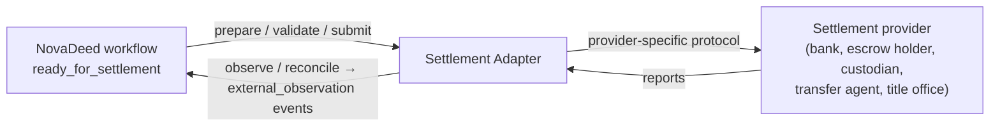
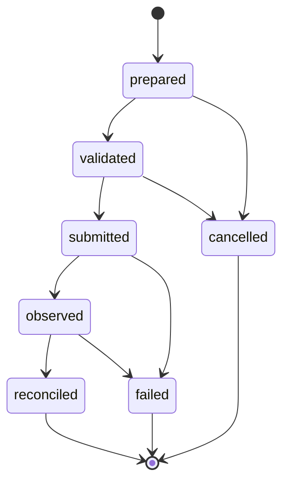

# Settlement Adapter

**Specification v0.1 — PRE-PRODUCTION / DESIGN SPECIFICATION**

**Status: interface semantics only. No Settlement Adapter is implemented in this repository, and none is in operation.**

## Purpose

Settlement — moving funds, delivering securities, releasing escrow, registering a transfer — is performed by institutions that are authoritative and, in most cases, regulated. Novera does not need to be, and is not designed to be:

- a bank;
- a custodian;
- a payment processor;
- a clearing or settlement system;
- a title office;
- a settlement institution.

The **Settlement Adapter** is the architectural boundary between a NovaDeed workflow and whatever provider actually performs settlement. The core sees only the adapter's lifecycle and the references it reports. Provider-specific and network-specific behaviour stays inside the adapter.

## Operations

The operations below are **interface semantics**: what each operation means and what it must guarantee. They are not an API. This specification does not define transport, authentication, payload encodings or endpoints.

| Operation | Input | Output | Semantics |
| --- | --- | --- | --- |
| `prepare()` | Workflow reference, confirmed workflow state, settlement parameters | Settlement instruction and its `instructionDigest` | Builds a provider-specific instruction from confirmed state only. MUST NOT contact the provider in a way that commits funds or assets. MUST be deterministic for the same inputs. |
| `validate()` | Prepared instruction | Validation outcome with reason codes | Checks the instruction against provider and adapter constraints: formats, limits, cut-off times, required parties. MAY consult the provider without committing. MUST NOT change workflow state. |
| `submit()` | Validated instruction, idempotency key | Provider reference | Hands the instruction to the provider. MUST be idempotent: repeating a submission with the same key MUST NOT create a second settlement. MUST only be invoked after the workflow has been confirmed into `settlement_pending`. |
| `observe()` | Provider reference | Provider-reported status, external and network references | Reports what the provider says has happened. Each material observation is recorded as an `external_observation` NoveraEvent by the adapter. MUST NOT itself change workflow state. |
| `reconcile()` | Observations, workflow state | Reconciliation outcome | Matches what the provider reports against what the workflow expected: parties, amounts, assets, references. A successful reconciliation allows a system component to propose the transition to `completed`. Discrepancies MUST be reported, not silently resolved. |

## Lifecycle

The adapter lifecycle is mirrored in the workflow's `settlementRef.status`:

| `settlementRef.status` | Meaning |
| --- | --- |
| `prepared` | An instruction exists, identified by `instructionDigest`. |
| `validated` | The instruction passed adapter and provider checks. |
| `submitted` | The provider has the instruction, identified by `providerReference`. |
| `observed` | The provider has reported progress or an outcome. |
| `reconciled` | The adapter matched the provider's report to the workflow. |
| `failed` | The provider or adapter reported failure. |
| `cancelled` | Settlement was withdrawn before submission completed. |

`reconciled` means the adapter has matched a provider's report to the workflow. **It is not a statement of legal finality or of payment finality.** Those are determined by the provider and the governing law.

## Relationship with NovaDeed

- A workflow in `settlement_pending` or `completed` MUST carry a `settlementRef` (schema-enforced).
- A workflow MUST NOT be `completed` unless `settlementRef.status` is `reconciled` (schema-enforced).
- Adapter operations never write workflow state. The adapter records `external_observation` events; workflow transitions still follow proposal, validation, confirmation and state transition, as in [event-model.md](event-model.md).
- Settlement results that the authoritative system records, such as a registration receipt from a title office, are carried in `settlementRef.externalRefs` and as evidence.

## Requirements for implementations

1. An adapter MUST be identified by an `adp_…` identifier, and its events MUST carry `actorType: "adapter"`.
2. An adapter MUST document the provider it targets, the provider's own finality rules and how `observe()` maps provider statuses to adapter statuses.
3. An adapter MUST NOT hold credentials in Novera records. Credentials belong in the adapter's own secret management.
4. Adapters MUST fail closed: if the provider is unreachable or its reports are ambiguous, the adapter reports `observed` with reason codes or `failed`; it MUST NOT report `reconciled`.
5. An adapter that uses a network, for example to settle a tokenized instrument, MUST do so through a Network Adapter and carry the resulting `networkRefs` in `settlementRef`. See [network-adapters.md](network-adapters.md).

## v0.1 limitations

- No adapter is implemented here, and no provider has been selected or integrated.
- No live network or provider calls are made by anything in this repository.
- Regulated settlement is out of scope for v0.1. A future adapter for a regulated provider would operate under that provider's authorizations, not Novera's.
- The reference workflow's example stops at `approved`, before settlement. See [workflows/real-estate-reference.md](../workflows/real-estate-reference.md).
