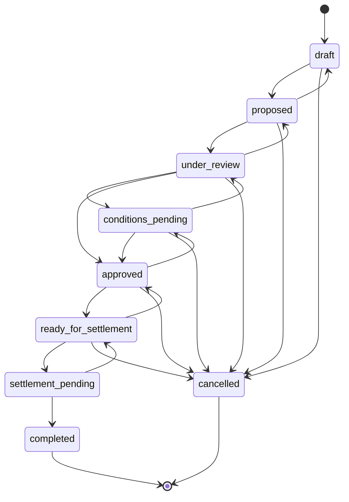
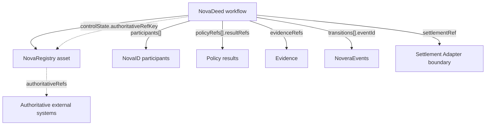

# NovaDeed — ownership, document and workflow state

**Specification v0.1 — PRE-PRODUCTION / DESIGN SPECIFICATION**

Schema: [workflow.schema.json](../schemas/workflow.schema.json) · Example: [workflow.example.json](../examples/workflow.example.json)

| | Status |
| --- | --- |
| Data model, schema and reference state machine | **Specified** in this repository |
| Validation of synthetic examples, including state-machine checks | **Implemented** (`npm run validate`) |
| Workflow engine | **Not built** |
| Settlement, registry and legal-workflow integrations | **Planned**; none is integrated |

## Purpose

NovaDeed represents **ownership, document and workflow state** for one transaction or process concerning one asset: who is involved and in what role, where the workflow stands, which policies gate it, which evidence supports it, what the authoritative record says about control, and how settlement is referenced.

> NovaDeed does not create, transfer or extinguish legally effective ownership. Those effects occur, if at all, in the authoritative external systems and legal processes that the workflow references — for example a land title registry and the parties' counsel. A NovaDeed record coordinates and records the workflow around them.

## Record

| Field | Required | Description |
| --- | --- | --- |
| `workflowId` | yes | Opaque identifier (`wfl_…`). Not a transaction hash. |
| `version` | yes | Record version. MUST equal the number of transitions. |
| `recordAuthority` | yes | Constant `non_authoritative_coordination_record`. |
| `workflowType` | yes | `transfer`, `purchase`, `financing`, `issuance`, `redemption`, `pledge`, `release`, or a namespaced extension. |
| `workflowProfile` | no | Namespaced identifier of the machine-readable workflow profile, for example `novera-ref:real_estate.purchase.reference`. |
| `workflowProfileVersion` | when profiled | Exact semantic version of `workflowProfile`; REQUIRED whenever `workflowProfile` is present. |
| `assetId` | yes | The NovaRegistry asset. |
| `participants` | yes | NovaID participants with `role` and `status` (`invited`, `active`, `withdrawn`). |
| `controlState` | yes | The workflow's view of control over the asset; see below. |
| `workflowState` | yes | Current state. MUST equal the `to` of the last transition. |
| `policyRefs` | yes | Policies that gate states; see below. |
| `evidenceRefs` | yes | Evidence supporting the workflow. |
| `transitions` | yes | Complete, ordered history of confirmed transitions. |
| `settlementRef` | yes | `null` before settlement begins; otherwise a Settlement Adapter reference. |
| `createdAt`, `updatedAt` | yes | Record timestamps. |
| `metadata` | no | Namespaced, non-normative metadata. |

Core participant roles: `buyer`, `seller`, `transferor`, `transferee`, `issuer`, `investor`, `lender`, `borrower`, `buyer_counsel`, `seller_counsel`, `agent`, `servicer`, `escrow_holder`. Profiles MAY define namespaced roles.

A workflow profile is a versioned protocol configuration record validated by [workflow-profile.schema.json](../schemas/workflow-profile.schema.json). Its transition rules define permitted proposer actor types and roles, required confirmer actor types and roles, confirmation thresholds and separation-of-duties requirements, required policies, and evidence categories. Implementations MUST resolve the exact `workflowProfile` + `workflowProfileVersion` pair before applying a profiled transition.

## Reference state machine

The core states form an **illustrative reference state machine**. They are coordination states, not legal categories: `approved` means the workflow's own conditions are recorded as met, not that any authority approved anything; `completed` means the workflow's settlement reference has been reconciled, not that legal finality has occurred.

| State | Meaning in the reference workflow |
| --- | --- |
| `draft` | Being assembled; not yet shared with counterparties. |
| `proposed` | Proposed to counterparties, for example an offer submitted. |
| `under_review` | A counterparty is reviewing the proposal. |
| `conditions_pending` | Agreed subject to conditions that are not yet recorded as met. |
| `approved` | All gating conditions recorded as met within the workflow. |
| `ready_for_settlement` | Prepared for handoff to a Settlement Adapter. |
| `settlement_pending` | Handed to an adapter; awaiting the provider. |
| `completed` | Terminal. The adapter has reconciled the provider's report. |
| `cancelled` | Terminal. The workflow was abandoned. |

Notes:

- `settlement_pending` cannot move to `cancelled` directly. Once a provider may be acting, the workflow MUST first return to `ready_for_settlement` after the adapter reports `failed` or `cancelled`. This prevents a workflow from being abandoned while external settlement could still complete.
- Profiles MAY define namespaced states. The validator applies the reference state machine only to transitions between two core states; a workflow that uses core states MUST be created in `draft`.

### Transitions

Each `transitions` entry records one confirmed transition:

| Field | Description |
| --- | --- |
| `sequence` | 1-based and contiguous. |
| `from` | Previous state, or `null` for the creating transition only. |
| `to` | New state. |
| `eventId` | The `state_transition` NoveraEvent that recorded it. Each event is used once. |
| `transitionedAt` | Strictly increasing. |
| `reasonCodes` | Namespaced reasons, for example `offer.accepted_conditionally`. |

The validator checks contiguity, `from` chaining, ordering, permitted moves, that `version` equals the number of transitions, and that `workflowState` matches the last `to`.

**Every material transition MUST create a NoveraEvent.** A transition appears in `transitions` only after the `state_transition` event is confirmed; proposals, validations and confirmations that precede it are separate events. See [event-model.md](../architecture/event-model.md).

## Control state

`controlState` mirrors **what the authoritative record says** about control of the asset, and what the workflow proposes. It is not a Novera determination of ownership.

| Field | Description |
| --- | --- |
| `status` | `unchanged`, `change_proposed`, `change_agreed_conditionally`, `change_agreed`, `pending_external_registration`, `recorded_externally`, `withdrawn`. |
| `recordedControllerRefs` | Participants the authoritative source reports as controlling the asset. |
| `proposedControllerRefs` | Participants proposed to control it. REQUIRED for the four change statuses. |
| `basis` | `authoritative_reference`, `participant_assertion` or `unknown`. |
| `authoritativeRefKey`, `observedAt` | REQUIRED when `basis` is `authoritative_reference`; the key MUST exist on the asset. |

`recorded_externally` is the only status in which control has changed, and it means the authoritative system reports the change and the report has been reconciled. Every controller reference MUST be a workflow participant.

## Policy gating

Each `policyRefs` entry names a policy, its version, the states it gates (`requiredFor`) and its results (`resultRefs`). A workflow **MUST NOT** enter a state listed in `requiredFor` unless the latest result for that policy is `pass` or `not_applicable`.

For the included reference workflow, the validator resolves the current transition against the pinned workflow profile, verifies proposer/confirmer authorization, and resolves each profile-required policy gate to its latest referenced result. Evidence-type requirements are machine-readable in the profile but are not yet fully resolved across every evidence reference.

Policy results are evaluation results, not legal conclusions. See [policy-model.md](../architecture/policy-model.md).

## Settlement reference

`settlementRef` is `null` until settlement begins. When present it is produced by a Settlement Adapter and carries `adapterId`, `settlementType`, `status` (`prepared`, `validated`, `submitted`, `observed`, `reconciled`, `failed`, `cancelled`), optional `instructionDigest`, `providerReference`, `externalRefs`, `networkRefs`, and `updatedAt`.

Schema rules:

- `settlement_pending` and `completed` REQUIRE a non-null `settlementRef`.
- `completed` REQUIRES `settlementRef.status` to be `reconciled`.

`reconciled` means the adapter matched the provider's report to the workflow; it is not a statement of legal finality. Novera does not perform settlement. See [settlement-adapter.md](../architecture/settlement-adapter.md).

## Relationships with the other primitives

## Example

[workflow.example.json](../examples/workflow.example.json) is a synthetic residential purchase, version 5, in `approved`:

| # | From | To | Reason |
| --- | --- | --- | --- |
| 1 | — | `draft` | `workflow.created` |
| 2 | `draft` | `proposed` | `offer.submitted` |
| 3 | `proposed` | `under_review` | `offer.received_by_seller` |
| 4 | `under_review` | `conditions_pending` | `offer.accepted_conditionally` |
| 5 | `conditions_pending` | `approved` | `conditions.all_met` |

Participants are Buyer A, the seller and buyer's counsel. `controlState` is `change_agreed`: the land-title reference reports the seller as controller, and the buyer is proposed. `settlementRef` is `null`. The walkthrough is in [real-estate-reference.md](../workflows/real-estate-reference.md).

## Out of scope for v0.1

- A workflow engine, persistence or APIs.
- Executing settlement, registration or document signing.
- Normative workflow profiles beyond the illustrative reference profile.
