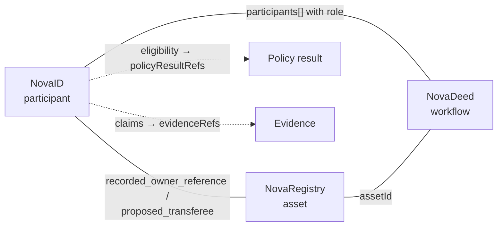

# NovaID — participant and eligibility state

**Specification v0.1 — PRE-PRODUCTION / DESIGN SPECIFICATION**

Schema: [participant.schema.json](../schemas/participant.schema.json) · Example: [participant.example.json](../examples/participant.example.json)

| | Status |
| --- | --- |
| Data model and schema | **Specified** in this repository |
| Validation of synthetic examples | **Implemented** (`npm run validate`) |
| Identity-provider integrations | **Planned**; none is integrated |
| Production service | **Not built** |

## Purpose

NovaID represents **participant and eligibility state associated with a Novera workflow**: who is taking part, what has been claimed about them, by whom, for what purpose, and whether they meet the conditions of a specific workflow.

> NovaID is not an identity provider. A NovaID record does not represent a claim by Novera that a participant's identity has been verified.

Identity verification, sanctions screening, investor qualification and similar determinations are made by identity providers, financial institutions, professionals and authorities. NovaID records what they reported, with provenance, scoped to the context in which it was reported.

## Record

| Field | Required | Description |
| --- | --- | --- |
| `participantId` | yes | Opaque identifier (`ptc_…`). Not an account address, not a provider identifier. |
| `version` | yes | Record version; see [state-model.md](../architecture/state-model.md). |
| `recordAuthority` | yes | Constant `non_authoritative_coordination_record`. |
| `participantType` | yes | `individual`, `organization`, `institution`, `service_provider`, `system`, or a namespaced extension. |
| `label` | no | Non-identifying label used within a workflow, for example `Buyer A`. MUST NOT contain a natural person's name or direct identifier. |
| `claims` | yes | Scoped claims with issuer, status, evidence and provenance; see below. |
| `eligibilityStates` | yes | Eligibility per scope; see below. |
| `evidenceRefs` | yes | Evidence records supporting the participant record. |
| `issuerRefs` | yes | Descriptions of every issuer named by a claim. |
| `status` | yes | `active`, `suspended` or `closed`, within the deployment. Not a statement about legal standing. |
| `createdAt`, `updatedAt` | yes | Record timestamps. |
| `metadata` | no | Namespaced, non-normative metadata. |

Participant types are extensible: implementations MAY use namespaced types (`acme:trust_vehicle`) without a schema change.

## No global "verified" flag

NovaID deliberately has no `verified: true` field. A statement such as "this participant is verified" is ambiguous — verified by whom, against what, for what purpose, until when? Every statement is instead a **claim** with five parts:

| Part | Field | Question answered |
| --- | --- | --- |
| Claim | `claimType`, `statement`, optional `valueDigest` | What is claimed? |
| Issuer | `issuerId` → `issuerRefs` | Who made the claim? |
| Scope | `scope` | For which workflow, asset, program or deployment, and which purpose? |
| Status | `status`, `statusReasonCodes` | What is its current standing? |
| Evidence | `evidenceRefs`, `provenance` | What supports it, and how was it recorded? |
| Validity | `assertedAt`, `confirmedAt`, `validFrom`, `validUntil` | When does it apply? |

A claim MUST NOT be relied on outside its `scope`. There is no global scope.

### Claim types

`identity`, `legal_entity_status`, `residence`, `sanctions_screening`, `investor_qualification`, `authority_to_act`, `proof_of_funds`, `financing_commitment`, `professional_licence`, or a namespaced extension.

### Claim content and personal data

- `statement` is a short, **non-identifying** description, for example "Identity checked against a government-issued document". It MUST NOT contain the underlying personal data.
- `valueDigest` MAY commit to the claimed value without revealing it. The salt and value remain with the issuer or the participant.
- Documents supporting the claim are evidence records, normally stored `hash_only`. See [evidence-model.md](../architecture/evidence-model.md).

### Claim status

| Status | Meaning | Schema requirement |
| --- | --- | --- |
| `asserted` | Stated by someone, not yet checked. | — |
| `pending` | Submitted for checking by an issuer or provider. | — |
| `confirmed` | The issuer reported the claim as satisfied, for the stated scope. | `confirmedAt` and at least one `evidenceRefs` entry |
| `rejected` | The issuer reported the claim as not satisfied. | at least one `statusReasonCodes` entry |
| `expired` | The validity window has passed. | `validUntil` |
| `revoked` | The issuer withdrew the claim. | at least one `statusReasonCodes` entry |

**Confirmation depends on the issuer.** A claim is `confirmed` because an identity provider, financial institution, professional or authority reported it so — not because Novera checked it. The validator additionally rejects a self-issued claim (issuer type `self`) that is `confirmed` by `self_assertion` alone.

### Provenance

Each claim records how it entered the record:

| `provenance.method` | Meaning |
| --- | --- |
| `provider_check` | Reported by a provider after its own check. |
| `document_review` | Recorded after review of a document by an authorized person. |
| `registry_query` | Taken from a registry query. |
| `self_assertion` | Stated by the participant about itself. |
| `professional_attestation` | Attested by a professional, such as counsel. |

plus `recordedBy` (the actor), `recordedAt` and an optional opaque `providerReference`.

## Eligibility

An **eligibility state** says whether a participant meets the conditions of one scope:

| Field | Description |
| --- | --- |
| `scope` | The workflow, asset, program or deployment, and purpose. |
| `status` | `pending`, `eligible`, `not_eligible`, `requires_review`, `expired` or `revoked`. |
| `basisClaimRefs` | Claims in this record that the determination relied on. The validator checks they exist. |
| `policyResultRefs` | Policy results behind the determination. At least one is REQUIRED for `eligible` and `not_eligible`. |
| `determinedBy` | The actor. MUST NOT be an assistive system. |
| `determinedAt`, `validUntil` | Timing. |

Eligibility for one workflow says nothing about any other workflow.

## Relationships with the other primitives

- A NovaDeed workflow lists participants by `participantId` and role, and MAY require a current eligibility state in its scope before a transition.
- A NovaRegistry asset MAY relate to participants, for example as the recorded owner reference reported by an authoritative source.

## Example

[participant.example.json](../examples/participant.example.json) is a synthetic individual labelled `Buyer A` with three claims scoped to the reference purchase workflow in fictional jurisdiction `XZ`:

| Claim | Issuer | Method | Status |
| --- | --- | --- | --- |
| `identity` | Fictional Identity Verification Service (synthetic) | `provider_check` | `confirmed` |
| `financing_commitment` | Fictional Lender (synthetic) | `document_review` | `confirmed` |
| `residence` | Participant (self-asserted) | `self_assertion` | `asserted` |

Its single eligibility state is `eligible` for `real_estate.purchase.participant_eligibility`, based on the identity claim and the workflow's policy result. None of this is a statement by Novera about a real person.

## Out of scope for v0.1

- Performing identity verification, screening or qualification checks.
- Storing identity documents or personal data in Novera records.
- Reusable cross-deployment identity, decentralized identifiers or verifiable-credential formats. Mapping claims to W3C Verifiable Credentials is an open question.
