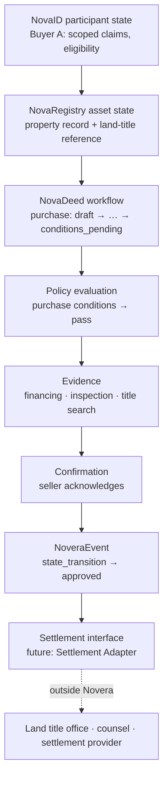

# Real estate reference workflow

**REFERENCE WORKFLOW — Specification v0.1, PRE-PRODUCTION / DESIGN SPECIFICATION**

**All identifiers, names, jurisdictions and documents below are SYNTHETIC EXAMPLE DATA.** The jurisdiction `XZ`, the land title office, lender, identity service and every participant are fictional.

Real estate is the **first concrete workflow** used to demonstrate the architecture. Novera is not a real-estate protocol; the same primitives, event model and boundaries are intended to apply to other asset classes through other profiles.

## What this workflow does not do

- **NovaDeed does not replace a land registry.** The land title office remains the authoritative record of title.
- **Novera does not independently perform title transfer.** Any transfer occurs through the land title office and the parties' legal process.
- **Novera does not provide legal advice.** Conditions, reason codes and policy results are coordination artifacts, not legal conclusions.
- **Novera does not perform regulated settlement in v0.1.** Settlement is represented only as a Settlement Adapter interface; no adapter is implemented and no funds move.

## Mapping

| Workflow element | Novera representation | Example file |
| --- | --- | --- |
| Buyer participant state | NovaID participant `Buyer A`, with scoped claims and an eligibility state | [participant.example.json](../examples/participant.example.json) |
| Seller participant state | NovaID participant (referenced by ID; record not included in v0.1 examples) | — |
| Property asset record | NovaRegistry asset, `real_estate`, linked to the land-title reference | [asset.example.json](../examples/asset.example.json) |
| Offer / workflow state | NovaDeed workflow `purchase`, reference profile | [workflow.example.json](../examples/workflow.example.json) |
| Policy conditions | Policy results for participant eligibility and purchase conditions | [policy-result.example.json](../examples/policy-result.example.json) |
| Evidence | Evidence records: offer, financing commitment, inspection report, title search result. Only the financing commitment is included as an example file; the others are referenced by ID. | [evidence.example.json](../examples/evidence.example.json) |
| Ownership / document workflow | NovaDeed `controlState` mirroring the land-title reference, plus transitions | [workflow.example.json](../examples/workflow.example.json) |
| Settlement interface | `settlementRef` (null at this stage) and the Settlement Adapter interface | [settlement-adapter.md](../architecture/settlement-adapter.md) |
| Material transitions | NoveraEvents | [real-estate-sequence/](../examples/real-estate-sequence/), [event.example.json](../examples/event.example.json) |

Participants: Buyer A (`buyer`), the seller (`seller`) and buyer's counsel (`buyer_counsel`, acting on behalf of Buyer A).

## Conceptual flow

The arrows show the order of reasoning in this example, not automatic writes. Each change to a Novera record is made only by a confirmed `state_transition` event.

## Workflow history

The example workflow is at version 5:

| # | From | To | Reason code | Event |
| --- | --- | --- | --- | --- |
| 1 | — | `draft` | `workflow.created` | `evt_0qsv…` |
| 2 | `draft` | `proposed` | `offer.submitted` | `evt_24f6…` |
| 3 | `proposed` | `under_review` | `offer.received_by_seller` | `evt_01rw…` |
| 4 | `under_review` | `conditions_pending` | `offer.accepted_conditionally` | `evt_374x…` |
| 5 | `conditions_pending` | `approved` | `conditions.all_met` | `evt_6gad…` |

Only the events for transition 5 are included as example files; the earlier event IDs are references in the history.

## State-transition example: `conditions_pending` → `approved`

### Starting state (version 4)

- `workflowState`: `conditions_pending`.
- `controlState.status`: `change_agreed_conditionally`. The land-title reference reports the seller as controller; Buyer A is proposed.
- Gating policy: `novera-ref:real_estate.purchase.conditions` v0.1.0 has `requiredFor: ["approved"]`. The workflow MUST NOT enter `approved` unless the latest result for this policy is `pass` or `not_applicable`.

### Evidence

| Evidence | Purpose | Example record |
| --- | --- | --- |
| Financing commitment letter (fictional lender) | Financing condition. Reviewed and accepted by buyer's counsel. | [evidence.example.json](../examples/evidence.example.json): `hash_only`, `confidential`, contains personal data |
| Inspection report | Inspection condition | Referenced by ID only |
| Title search result | References the authoritative land-title record | Referenced by ID only |

For the included record, Novera holds the content hash and handling classification, not the document. The specification recommends `hash_only` storage for documents of this kind ([evidence-model.md](../architecture/evidence-model.md#storage-modes)).

### Policy evaluation

`plr_23jr…` evaluates `novera-ref:real_estate.purchase.conditions` against workflow version 4 using `deterministic_rules`:

| Condition | Result | Evidence |
| --- | --- | --- |
| `financing` — a financing commitment has been accepted by buyer counsel | `pass` | financing commitment |
| `inspection` — report received, no objection within the review period | `pass` | inspection report |
| `title-search` — title search references the authoritative record named in the asset record | `pass` | title search result |

Overall result: `pass`, valid for seven days. The result records `resultAuthority: "evaluation_result_not_legal_determination"`: it says the configured rules passed for these inputs, not that the conditions are legally satisfied.

### Events

| # | File | Event | Actor | Meaning |
| --- | --- | --- | --- | --- |
| 1 | [01-proposal.event.json](../examples/real-estate-sequence/01-proposal.event.json) | `proposal` | Buyer's counsel, on behalf of Buyer A | Notice of fulfilment of conditions. Proposes version 5 in `approved`, citing the financing and inspection evidence and the policy result. |
| 2 | [02-validation.event.json](../examples/real-estate-sequence/02-validation.event.json) | `validation` | Validation system | Checks the proposal against version 4, the policy result and the evidence. Caused by event 1. |
| 3 | [03-confirmation.event.json](../examples/real-estate-sequence/03-confirmation.event.json) | `confirmation` | Seller | Acknowledges fulfilment. Caused by events 1 and 2. |
| 4 | [event.example.json](../examples/event.example.json) | `state_transition` | State system | Applies the confirmed change. `confirmedStateRef` is version 5, `approved`. Caused by events 1–3. |

All four events carry the same `previousStateRef` (version 4) and `proposedStateRef` (version 5, with the same state digest). The digest binds the proposal, validation and confirmation to the exact state that is finally applied: if the proposed state had changed, the digest would not match and the transition would not be applied. The `state_transition` is also the event named in `transitions[4].eventId`.

### Resulting state (version 5)

- `workflowState`: `approved`.
- `controlState.status`: `change_agreed`. Control has **not** changed: the land-title reference still reports the seller as controller. Only the workflow's agreement state changed.
- `settlementRef`: `null`.

## What would happen next (not specified as behaviour in v0.1)

1. `approved` → `ready_for_settlement` once a settlement profile's gating policy passes.
2. `ready_for_settlement` → `settlement_pending` when a Settlement Adapter has `prepared`, `validated` and `submitted` an instruction to an external provider.
3. The land title office records the transfer through its own process. The adapter `observe`s and `reconcile`s the provider's report; `controlState` may then move through `pending_external_registration` to `recorded_externally`.
4. `settlement_pending` → `completed` only when `settlementRef.status` is `reconciled`.

None of these steps is implemented. No adapter, provider, registry or network is integrated.

## Why this workflow

Residential purchase is a well-understood multi-party process with an authoritative registry, document-heavy conditions and a separate settlement step. It exercises every primitive and boundary in the specification. It is a reference, not a product commitment: Novera does not claim support for any real jurisdiction's conveyancing process.
